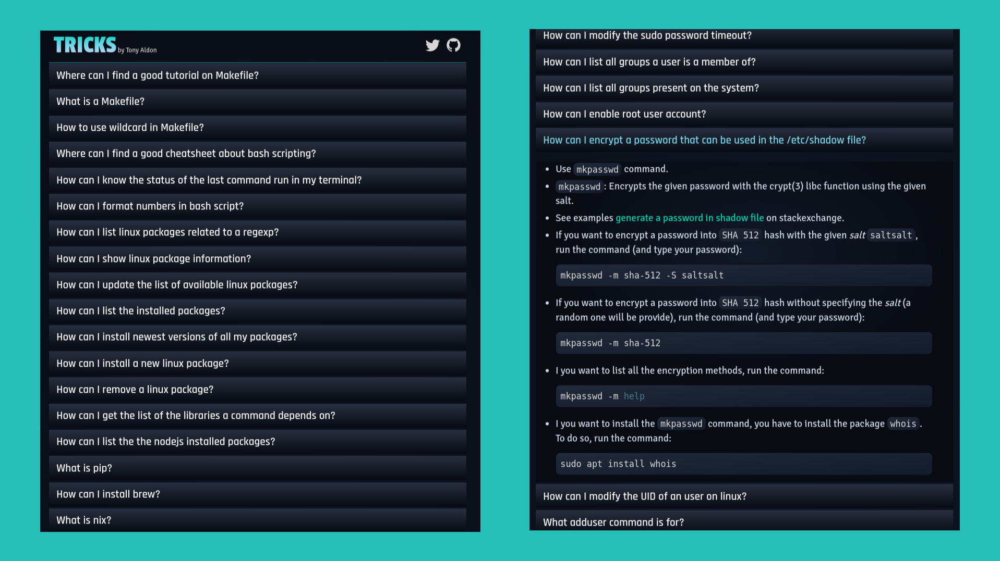

# About

`tricks-app` repository holds the code off the web application
[tricks](https://tricks.tonyaldon.com/).

I just gather some `problems/questions/errors` I had to figure out to
setup my linux environment and to feel at home using linux.

The app takes the form of a Q&A.

So far the app contains 166 questions on `gtk`, `rsync`, `i3`, `ssh`,
`fonts`, `usb drives`, `symbolic links`, `watching files`, `CPU`,
`RAM`, `sudo`, ....

You can find all my notes on computing [here](https://github.com/tonyaldon/tricks).

# Motivation

Although I enjoye taking my notes with
[org-mode](https://orgmode.org/) inside `emacs`, I sometime want to
read/scroll them on my mobile as any other classic apps.

# Programming details

1. As I don't want to modify my notes without `emacs`, this application
   doesn't aim to implement the features provide by `org-mode` along
   with `emacs`. Therefore, I don't need a `backend` and the
   `frontend` would be light.

2. I'm using [orgajs](https://github.com/orgapp/orgajs) to parse my
   `org` file.

3. I'm using [highlightjs](https://highlightjs.org/) to highlight
   chunks of code with the theme
   [discreet-theme](https://github.com/tonyaldon/discreet-theme).

4. This project was bootstrapped with [Create React
   App](https://github.com/facebook/create-react-app). More
   details in the section below.

5. This app is deployed using [github
   pages](https://pages.github.com/). More details in the section below.

# Deploy (github page)

To deploy as a github page, I just run:

	npm run deploy

To work, I added to `package.json` file the line

	"homepage": "https://tricks.tonyaldon.com"

and the elements `predeploy` and `deploy` as part of the `scripts`
element as follow:

    "predeploy": "npm run build",
    "deploy": "gh-pages -b master -r git@github.com:tonyaldon/tonyaldon.github.io.git -d build"

I also added a `CNAME` file that contains `tricks.tonyaldon.com` to
get my custom domain working. As I'm working with `create-react-app`,
the `CNAME` file is part of the `public` directory.

So, when I run the command `npm run deploy`, this produces a new
commit in my repository `tonyaldon.github.io` on the `master` branch
with the new build of the app and as a consequence of github pages
the app at `https://tricks.tonyaldon.com` gets updated.

# Ceate React App

## Available Scripts

In the project directory, you can run:

### `npm start`

Runs the app in the development mode. 
Open [http://localhost:3000](http://localhost:3000) to view it in the browser.

The page will reload if you make edits. 
You will also see any lint errors in the console.

### `npm test`

Launches the test runner in the interactive watch mode. 
See the section about [running tests](https://facebook.github.io/create-react-app/docs/running-tests) for more information.

### `npm run build`

Builds the app for production to the `build` folder. 
It correctly bundles React in production mode and optimizes the build for the best performance.

The build is minified and the filenames include the hashes. 
Your app is ready to be deployed!

See the section about [deployment](https://facebook.github.io/create-react-app/docs/deployment) for more information.

## Learn More

You can learn more in the [Create React App documentation](https://facebook.github.io/create-react-app/docs/getting-started).
